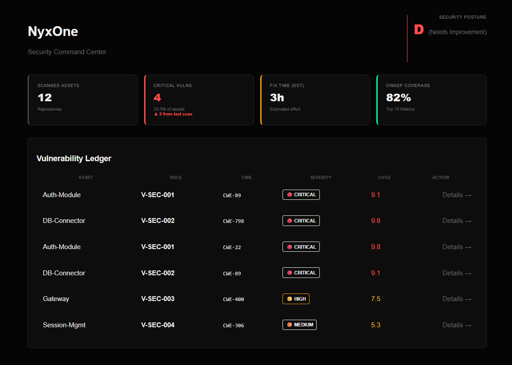

# NyxOne: Enterprise Risk Intelligence Platform

> *NyxOne: Enterprise Risk Intelligence at scale. Diseñado para orquestrar la remediación, mejorar la postura de seguridad (Security Posture) e integrar el ciclo de vida del desarrollo con inteligencia de datos real.*

NyxOne es una plataforma de auditoría estratégica diseñada para transformar datos crudos de código en decisiones de seguridad accionables. Enfocada en la visibilidad ejecutiva y el análisis de vulnerabilidades, NyxOne permite identificar brechas críticas, calcular el impacto de negocio (CVSS) y priorizar la remediación técnica.

## 🚀 Arquitectura y Capacidades
NyxOne opera mediante un motor de análisis estático (SAST) que procesa la estructura del código para identificar vectores de ataque como:
*   **CWE-89 (SQL Injection):** Detección de concatenación insegura.
*   **CWE-798 (Hardcoded Credentials):** Identificación de secretos expuestos.
*   **CWE-22 (Path Traversal):** Análisis de rutas de archivos inseguras.

## 🛠️ DevSecOps & Infraestructura

NyxOne está diseñado para ser integrado desde el primer día en pipelines de automatización, garantizando que la seguridad sea un estándar de calidad, no una revisión manual.

### Integración CI/CD
El repositorio incluye una configuración de **Jenkins Pipeline** (`Jenkinsfile`) que automatiza el proceso de auditoría:
- **Security Analysis Stage:** Ejecuta el motor de NyxOne de forma automatizada sobre el código fuente antes de cualquier despliegue.
- **Fail-Fast Compliance:** Si se detectan vulnerabilidades críticas (ex: SQLi o Hardcoded Secrets), el pipeline se interrumpe inmediatamente para prevenir despliegues inseguros.

### Contenedorización
Para garantizar la portabilidad y coherencia del entorno de escaneo, NyxOne incluye un **Dockerfile** optimizado, permitiendo que el motor de seguridad sea ejecutado en cualquier entorno de integración (Docker, Kubernetes o entornos Cloud nativos) sin conflictos de dependencias.

### Visualización Ejecutiva (BI Dashboard)
El dashboard centraliza la postura de seguridad (Security Posture), permitiendo a los equipos de ingeniería y liderazgo comprender:
- **Prioridad:** Badges de severidad (🔴 Crítico, 🟡 Alto, 🟠 Medio).
- **Contexto:** Métrica de cobertura OWASP y tiempos estimados de remediación.
- **Transparencia:** Visibilidad total de activos afectados y CVSS real.

## 📈 Roadmap de Desarrollo (MVP v1.0)
Actualmente, NyxOne se encuentra en su fase de **Análisis de Motor Semántico**. Próximos hitos:
1.  **Integración CI/CD:** Automatización de escaneos mediante GitHub Actions.
2.  **Análisis por AST:** Migración de Regex hacia *Abstract Syntax Tree* para mayor precisión.
3.  **Persistencia:** Almacenamiento histórico de vulnerabilidades para tracking de tendencias.

---
*Desarrollado como motor de análisis de riesgo de capital humano y software.*

